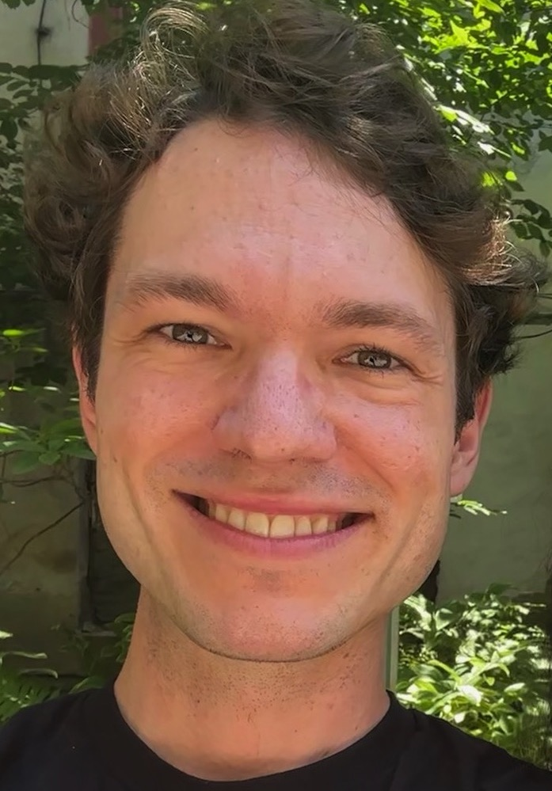

# Damek Davis

  

    
  

    I joined <a href="https://statistics.wharton.upenn.edu/">Wharton's Department of Statistics and Data Science</a> on July 1, 2024. I was previously an Associate Professor of Operations Research and Information Engineering at Cornell University. Before that, I completed an <a href="https://www.nsf.gov/awardsearch/showAward?AWD_ID=1502405&HistoricalAwards=false">NSF Postdoctoral Fellowship in 2016</a> and received my Ph.D. in mathematics both from the University of California, Los Angeles. My PhD advisors were <a href="https://wotaoyin.mathopt.com/">Wotao Yin</a> and <a href="https://web.cs.ucla.edu/~soatto/">Stefano Soatto</a>. 
  

I am interested in the mathematics of data science, particularly the interplay of optimization, signal processing, statistics, and machine learning. I enjoy designing and analyzing learning algorithms based on optimization. You can read more about my research in my <a href="#research-overview">research overview</a> or <a href="#publications">publications</a>. You can also check out my three favorite recent projects on exponential accelerations of <a href="https://x.com/damekdavis/status/1841596498204880924">Gradient Descent</a>, <a href="https://twitter.com/damekdavis/status/1596616542396944384">Semismooth Newton methods</a>, and <a href="https://twitter.com/damekdavis/status/1682737261727866882?s=20">Subgradient methods</a> on Twitter.

My research has received several awards, including a <a href="https://sloan.org/fellowships/">Sloan Research Fellowship in Mathematics</a>, the <a href="https://www.informs.org/Recognizing-Excellence/Award-Recipients/Damek-Davis">INFORMS Optimization Society Young Researchers Prize</a>, an <a href="https://www.nsf.gov/awardsearch/showAward?AWD_ID=2047637">NSF CAREER Award</a>, and the <a href="https://www.siam.org/prizes-recognition/activity-group-prizes/detail/siag-opt-best-paper-prize">SIAM Activity Group on Optimization Best Paper Prize</a>. I am currently an associate editor at <a href="https://www.springer.com/journal/10107">Mathematical Programming</a> and <a href="https://www.springer.com/journal/10208">Foundations of Computational Mathematics</a>.

Please use [my email](mailto:damek@wharton.upenn.edu) sparingly for correspondence related to research questions, teaching, or other professional inquiries. 

**New course:** I'm teaching [optimization in PyTorch](STAT-4830).

[Publications](#publications) | [CV](cv.pdf) | [Twitter](https://twitter.com/damekdavis) | [Github (personal)](https://github.com/damek) | [Github (old lab)](https://github.com/COR-OPT) | [Google Scholar](https://scholar.google.com/citations?user=uGdPyZQAAAAJ&hl=en) 

## Students

I am currently recruiting PhD students at Penn. If you are a Penn student and wish to discuss advising/collaboration, send me a concise, informative email to set up a meeting.

If you're not currently a Penn student, please apply through the [Wharton Statistics and Data Science PhD program](https://statistics.wharton.upenn.edu/programs/phd). I receive many emails from applicants and cannot read/reply to all of them. Most of these emails are generic and are only personalized by including a title of one of my papers. To increase your chance of your email being read, write a concise email that only you could write. 

**Current PhD Students**
[Tao Jiang](https://taotolojiang.github.io/) (Cornell)
Status: A exam passed 
Next position: Postdoc at Meta with Lin Xiao

**Graduated PhD Students**
[Liwei Jiang](https://liwei-jiang97.github.io/) 
Next position: Georgia Tech ISYE Postdoc, then Assistant Professor at Purdue
[Vasilis Charisopoulos](https://people.orie.cornell.edu/vc333/) 
Next position: University of Chicago postdoc, then Assistant Professor at University of Washington, Seattle
[Mateo Díaz](https://mateodd25.github.io/) 
Next position: Caltech CMS postdoc, then Assistant Professor at Johns Hopkins University
[Ben Grimmer](https://www.ams.jhu.edu/~grimmer/) 
Next position: Assistant Professor at Johns Hopkins University

## Teaching

**Spring 2025**
[STAT 4830: Numerical optimization for data science and machine learning](STAT-4830)

**Lecture notes**
[Optimization: Structure, Duality, Calculus, and Algorithms](https://damek.github.io/teaching/orie6300/ORIE6300Fall2023notes.pdf) 
Draft of F’2023 notes for my course [ORIE 6300](https://damek.github.io/orie6300.html) 

## Honors and awards
[SIAM Activity Group on Optimization Best Paper Prize](https://www.siam.org/prizes-recognition/activity-group-prizes/detail/siag-opt-best-paper-prize) (2023)
[NSF CAREER Award](https://www.nsf.gov/awardsearch/showAward?AWD_ID=2047637)  (2021)
[Sloan Research Fellowship in Mathematics](https://sloan.org/fellowships/) (2020)
[INFORMS Optimization Society Young Researchers Prize](https://www.informs.org/Recognizing-Excellence/Award-Recipients/Damek-Davis) (2019)
Finalist for the Best Paper Prize for Young Researchers in Continuous Optimization (2019)
[Finalist for A. W. Tucker Prize for outstanding doctoral thesis](http://www.mathopt.org/?nav=tucker)  (2018)
NSF Math Postdoctoral Fellowship (2015)
Pacific Journal of Mathematics Dissertation Prize (2015)
INFORMS Optimization Society Student Paper Prize (2014)
NSF Graduate Research Fellowship (2010)
Elected to Phi Beta Kappa (2009)

# Research overview
(My complete publication list can be viewed [below](#publications), on my [CV](cv.pdf), or on [Google Scholar](https://scholar.google.com/citations?user=uGdPyZQAAAAJ&hl=en).)

Learning algorithms work exceptionally well in practice, but we have yet to find a coherent mathematical foundation explaining when they work and how to improve their performance. The challenge is that most learning algorithms rely on fitting highly nonlinear models via simple nonconvex optimization heuristics, and except for a few exceptional cases, there is no guarantee they will find global optima. Despite this and NP-hardness, simple heuristics often succeed, and over the last few years, I have studied why and when they do.

I spend a lot of time thinking about neural networks. I am particularly interested in whether we can provide provable convergence guarantees to standard training algorithms or substantially improve existing methods. Deep networks fall outside the scope of classical optimization theory since they lead to problems that lack conventionally helpful notions of convexity or smoothness. Taking the inherent *nonsmooth* structure of neural networks seriously is crucial to understand these methods. I study this structure and the associated algorithms by using and developing tools from several disciplines, including [nonsmooth/variational analysis](https://link.springer.com/book/10.1007/978-3-642-02431-3), [tame geometry](https://epubs.siam.org/doi/10.1137/080722059), and [high-dimensional statistics](https://www.cambridge.org/core/books/highdimensional-statistics/8A91ECEEC38F46DAB53E9FF8757C7A4E). 

## Algorithms for nonsmooth optimization in machine learning
While neural networks are nonsmooth, they are not pathological — they are built from just a few simple components, like polynomials, exponentials, logs, max’s, min’s, and absolute values. The best model of such non-pathological functions available in optimization is the so-called *tame class,* a class which appears in several of my papers and precludes [cantor function](https://en.wikipedia.org/wiki/Cantor_function)-esque behavior. I have spent much time trying to uncover notions of beneficial “partial” smoothness in tame optimization problems to exploit this structure in algorithms. 

While tame problems comprise virtually all tasks of interest, they lack enough structure to endow simple iterative methods with global efficiency guarantees. A class with more structure, which I view as a stepping stone between convex functions and general neural networks, is the so-called *weakly convex* class. These are functions that differ from convex functions by a simple quadratic. This class is deceptively simple yet surprisingly broad. It includes, for example, all C^2 smooth functions (on compact sets) and all compositions of Lipschitz convex functions with smooth mappings: h(c(x)). These losses appear throughout data science, particularly in low-rank matrix recovery problems (e.g., matrix completion and sensing). 

My group has been working towards understanding the convergence of simple iterative methods, such as the stochastic subgradient method (SGD), on the tame and weakly convex problem classes. We have also been working towards designing methods that outperform SGD. 

I will briefly summarize some of the contributions of my group. For those interested, you can find a brief technical introduction to some of my papers in the expository note: 

[Subgradient methods under weak convexity and tame geometry](https://damek.github.io/ViewsAndNews-28-1.pdf) 
Damek Davis, Dmitriy Drusvyatskiy
SIAG/OPT Views and News (2020)

### An exponential speedup for “generic” tame problems
We developed the first first-order method that (locally) converges nearly linearly (i.e., exponentially fast) on “generic” tame problems. This result shows that we can exponentially(!) surpass the “speed limit” of gradient methods derived by Nemirovski and Yudin in the 80s -- if we wait a bit. The result applies to “almost every problem” in practice. We found this super surprising!

[A nearly linearly convergent first-order method for nonsmooth functions with quadratic growth](https://arxiv.org/abs/2205.00064) 
Damek Davis, Liwei Jiang
Foundations of Computational Mathematics (to appear) | [code](https://github.com/COR-OPT/ntd.py) | [Twitter thread](https://twitter.com/damekdavis/status/1682389849167233027?s=20)

### A superlinearly convergent method for “generic” tame equations
We developed the first algorithm that (locally) converges nearly superlinearly (i.e., double exponentially fast) on “generic” tame equations. 

[A superlinearly convergent subgradient method for sharp semismooth problems](https://arxiv.org/abs/2201.04611) 
Vasileios Charisopoulos, Damek Davis
Mathematics of Operations Research (2023) | [code](https://github.com/COR-OPT/SuperPolyak.py) | [Twitter thread](https://twitter.com/damekdavis/status/1596616542396944384)

### Training guarantees for SGD on tame and weakly convex functions
We showed that the stochastic subgradient method (e.g., backpropagation) converges to first-order critical points on virtually any neural network.

[Stochastic subgradient method converges on tame functions](https://arxiv.org/abs/1804.07795) 
Damek Davis, Dmitriy Drusvyatskiy, Sham Kakade, Jason D. Lee
Foundations of Computational Mathematics (2018) | [Talk](https://damek.github.io/ICCOPT2019.pdf) 

We proved the first sample/computational efficiency guarantees for the stochastic subgradient method on the weakly convex class. 

[Stochastic model-based minimization of weakly convex functions](https://arxiv.org/abs/1803.06523) 
Damek Davis, Dmitriy Drusvyatskiy
SIAM Journal on Optimization (2018) | [blog](http://ads-institute.uw.edu//blog/2018/04/02/sgd-weaklyconvex/) 

[Proximally Guided Stochastic Subgradient Method for Nonsmooth, Nonconvex Problems.](https://arxiv.org/abs/1707.03505) 
Damek Davis, Benjamin Grimmer
SIAM Journal on Optimization (2018) [[code](https://github.com/COR-OPT/PGSG/blob/master/Interactive-PGSG.ipynb)]

### Avoidable saddle points in nonsmooth optimization
We developed the concept of an avoidable nonsmooth saddle point — nonoptimal points that algorithms may approach. The proper formulation of this concept is well-known in C^2 smooth optimization but was missing even for C^1 functions. We showed that both first-order and proximal methods do not converge to these points on “generic” tame problems:

[Talk: avoiding saddle points in nonsmooth optimization](https://damek.github.io/OWOSNov2021.pdf) 
Updated (11/2021) | [video](https://www.youtube.com/watch?v=6BOFWQhxYZE)

[Proximal methods avoid active strict saddles of weakly convex functions](https://arxiv.org/abs/1912.07146) 
Damek Davis, Dmitriy Drusvyatskiy
Foundations of Computational Mathematics (2021)

[Escaping strict saddle points of the Moreau envelope in nonsmooth optimization](https://arxiv.org/abs/2106.09815) 
Damek Davis, Mateo Díaz, Dmitriy Drusvyatskiy
SIAM Journal on Optimization (2022)

[Active manifolds, stratifications, and convergence to local minima in nonsmooth optimization](https://arxiv.org/abs/2108.11832) 
Damek Davis, Dmitriy Drusvyatskiy, Liwei Jiang
Manuscript (2022)

### Asymptotic normality of SGD in nonsmooth optimization
We characterized the asymptotic distribution of the error sequence in stochastic subgradient methods, proving it is asymptotically normal with “optimal covariance” on “generic” tame problems.

[Asymptotic normality and optimality in nonsmooth stochastic approximation](https://arxiv.org/abs/2301.06632) 
Damek Davis, Dmitriy Drusvyatskiy, Liwei Jiang
Manuscript (2023)

### Low-rank matrix recovery: a stepping stone to neural networks
We achieved the first sample complexity optimal and computationally optimal methods for several low-rank matrix recovery based on *nonsmooth* weakly convex formulations. Nonsmoothness was crucial to establishing these rates since prior smooth formulations suffered from “poor conditioning.”
 
[Composite optimization for robust rank one bilinear sensing](https://academic.oup.com/imaiai/advance-article-abstract/doi/10.1093/imaiai/iaaa027/5936039) 
Vasileios Charisopoulos, Damek Davis, Mateo Diaz, Dmitriy Drusvyatskiy
IMA Journal on Information and Inference (2020) [ [code](https://github.com/COR-OPT/RobustBlindDeconv) ]

[The nonsmooth landscape of phase retrieval](https://academic.oup.com/imajna/article-abstract/40/4/2652/5684995) 
Damek Davis, Dmitriy Drusvyatskiy, Courtney Paquette
IMA Journal on Numerical Analysis (2017) | [Talk](https://damek.github.io/NonsmoothStatisticalAssumptions.pdf) 

 [Low-rank matrix recovery with composite optimization: good conditioning and rapid convergence](https://arxiv.org/abs/1904.10020) 
Vasileios Charisopoulos, Yudong Chen, Damek Davis, Mateo Díaz, Lijun Ding, Dmitriy Drusvyatskiy
Foundations of Computational Mathematics (2019) | [code](https://github.com/COR-OPT/CompOpt-LowRankMatrixRecovery) 

## Other selected work 
Besides my work on nonconvex learning algorithms, I also have worked on clustering and convex optimization algorithms. 

### Provable clustering methods and a potential statistical-to-computational gap
Clustering is a fundamental statistical problem of dividing a dataset into two or more groups. Our work on this talk topic focuses on the classical setting wherein both clusters follow a Gaussian distribution with identical covariance but distinct means. When the covariance matrix is known or “nearly spherical,” there are efficient algorithms to perform the clustering and achieve the “Bayes-optimal error rate.” When the covariance is unknown or poorly conditioned, no known algorithms achieve the Bayes-optimal rate. 

Our contribution to this topic is a surprising dichotomy for clustering with an unknown covariance matrix: on the one hand, the maximum likelihood estimator uncovers the correct clustering and achieves the Bayes-optimal error; on the other, we give evidence that no known algorithm can compute the maximum likelihood estimator unless one increases the number of samples by an order of magnitude. Thus, we conjecture that there is a [statistical-to-computational gap](https://arxiv.org/abs/1803.11132) for this classical statistical problem.

[Clustering a Mixture of Gaussians with Unknown Covariance](https://arxiv.org/abs/2110.01602) 
Damek Davis, Mateo Diaz, Kaizheng Wang
Manuscript (2021)

### Three-Operator Splitting and the complexity of splitting methods
I focused on a class of convex optimization algorithms called operator-splitting methods for my PhD thesis. An operator splitting method is a technique for writing the solution of a “structured” convex optimization problem as the fixed-point of a well-behaved nonlinear operator. Algorithmically, one then finds the fixed-point of the operator through, e.g., the classical [fixed-point iteration](https://en.wikipedia.org/wiki/Fixed-point_iteration). My best-known contributions to the topic include the (1) “Three-Operator-Splitting” method, which has been widely used throughout computational imaging, and (2) my work that established the convergence rates of several classical splitting methods, such as the Douglas-Rachford splitting method and Alternating Direction Method of Multipliers (ADMM).

[A Three-Operator Splitting Scheme and its Optimization Applications](https://link.springer.com/article/10.1007/s11228-017-0421-z) 
Damek Davis, Wotao Yin
Set-Valued and Variational Analysis (2017)

[Convergence rate analysis of several splitting schemes](http://arxiv.org/abs/1406.4834) 
Damek Davis, Wotao Yin
Splitting Methods in Communication and Imaging, Science and Engineering (2017)

# Publications

[Preprints](#preprints) | [Conference papers](#conference-papers) | [Journal papers](#journal-papers) | [Book chapters](#book-chapters) | [Expository](#expository) | [Reports](#technical-reports)

## Preprints

[Gradient descent with adaptive stepsize converges (nearly) linearly under fourth-order growth](https://arxiv.org/abs/2409.19791)
Damek Davis, Dmitriy Drusvyatskiy, Liwei Jiang
Manuscript (2024)

##  Conference papers 

[Aiming towards the minimizers: fast convergence of SGD for overparametrized problems](https://arxiv.org/abs/2306.02601)
Chaoyue Liu, Dmitriy Drusvyatskiy, Mikhail Belkin, Damek Davis, Yi-An Ma
NeurIPS (2023) 

[A gradient sampling method with complexity guarantees for Lipschitz functions in high and low dimensions](https://arxiv.org/abs/2112.06969) 
Damek Davis, Dmitriy Drusvyatskiy, Yin Tat Lee, Swati Padmanabhan, Guanghao Ye
NeurIPS (2022) 
*Oral Presentation (top ~1%)*

[High probability guarantees for stochastic convex optimization](http://proceedings.mlr.press/v125/davis20a.html) 
Damek Davis, Dmitriy Drusvyatskiy
In Conference on Learning Theory (2020)

[Global Convergence of EM Algorithm for Mixtures of Two Component Linear Regression](http://proceedings.mlr.press/v99/kwon19a.html) 
Jeongyeol Kwon, Wei Qian, Constantine Caramanis, Yudong Chen, and Damek Davis
Conference on Learning Theory (2019)

[The Sound of APALM Clapping: Faster Nonsmooth Nonconvex Optimization with Stochastic Asynchronous PALM](https://papers.nips.cc/paper/6428-the-sound-of-apalm-clapping-faster-nonsmooth-nonconvex-optimization-with-stochastic-asynchronous-palm) 
Damek Davis, Brent Edmunds, Madeleine Udell
Neural Information Processing Systems (2016) | [report](https://arxiv.org/abs/1604.00526) 

[Multiview Feature Engineering and Learning](http://www.cv-foundation.org/openaccess/content_cvpr_2015/papers/Dong_Multi-View_Feature_Engineering_2015_CVPR_paper.pdf) 
Jingming Dong, Nikos Karianakis, Damek Davis, Joshua Hernandez, Jonathan Balzer and Stefano Soatto
In Proceedings of the IEEE Conference on Computer Vision and Pattern Recognition (2015)

[Asymmetric sparse kernel approximations for large-scale visual search.](http://www.vision.cs.ucla.edu/papers/davisBS14.pdf) 
Damek Davis, Jonathan Balzer, Stefano Soatto
In Proceedings of the IEEE Conference on Computer Vision and Pattern Recognition (2014)

## Journal papers 

[Active manifolds, stratifications, and convergence to local minima in nonsmooth optimization](https://arxiv.org/abs/2108.11832) 
Damek Davis, Dmitriy Drusvyatskiy, Liwei Jiang
Foundations of Computational Mathematics (to appear)

[Stochastic optimization over proximally smooth sets](https://arxiv.org/abs/2002.06309) 
Damek Davis, Dmitriy Drusvyatskiy, Zhan Shi
SIAM Journal on Optimization (to appear)

[Computational Microscopy beyond Perfect Lenses](https://arxiv.org/abs/2306.11283)
Xingyuan Lu, Minh Pham, Elisa Negrini, Damek Davis, Stanley J. Osher, Jianwei Miao
Physical Review E (to appear) 

[Global Optimality of the EM Algorithm for Mixtures of Two-Component Linear Regressions](https://ieeexplore.ieee.org/document/10614292)
Jeongyeol Kwon, Wei Qian, Constantine Caramanis, Yudong Chen, Damek Davis, Nhat Ho: 
IEEE Transactions on Information Theory (2024)

[Clustering a Mixture of Gaussians with Unknown Covariance](https://arxiv.org/abs/2110.01602) 
Damek Davis, Mateo Diaz, Kaizheng Wang
Bernoulli (to appear)

[Asymptotic normality and optimality in nonsmooth stochastic approximation](https://arxiv.org/abs/2301.06632) 
Damek Davis, Dmitriy Drusvyatskiy, Liwei Jiang
The Annals of Statistics (to appear)
*[Second Place in INFORMS Optimization Society 2024 Student Paper Prize](https://connect.informs.org/optimizationsociety/prizes/students-prize/2024)*

[A nearly linearly convergent first-order method for nonsmooth functions with quadratic growth](https://arxiv.org/abs/2205.00064) 
Damek Davis, Liwei Jiang
Foundations of Computational Mathematics (to appear) | [code](https://github.com/COR-OPT/ntd.py) | [Twitter thread](https://twitter.com/damekdavis/status/1682389849167233027?s=20)

[Stochastic algorithms with geometric step decay converge linearly on sharp functions](https://arxiv.org/abs/1907.09547) 
Damek Davis, Dmitriy Drusvyatskiy, Vasileios Charisopoulos
Mathematical Programming (to appear) | [code](https://github.com/COR-OPT/GeomStepDecay) 

[A superlinearly convergent subgradient method for sharp semismooth problems](https://arxiv.org/abs/2201.04611) 
Vasileios Charisopoulos, Damek Davis
Mathematics of Operations Research (2023) | [code](https://github.com/COR-OPT/SuperPolyak.py) | [Twitter Thread](https://twitter.com/damekdavis/status/1596616542396944384)

[Escaping strict saddle points of the Moreau envelope in nonsmooth optimization](https://arxiv.org/abs/2106.09815) 
Damek Davis, Mateo Díaz, Dmitriy Drusvyatskiy
SIAM Journal on Optimization (2022)

[Variance reduction for root-finding problems](https://link.springer.com/article/10.1007/s10107-021-01758-4) 
Damek Davis
Mathematical Programming (to appear)

[Conservative and semismooth derivatives are equivalent for semialgebraic maps](https://arxiv.org/abs/2102.08484) 
Damek Davis, Dmitriy Drusvyatskiy
Set-Valued and Variational Analysis (to appear)

[From low probability to high confidence in stochastic convex optimization](https://arxiv.org/abs/1907.13307) 
Damek Davis, Dmitriy Drusvyatskiy, Lin Xiao, Junyu Zhang
Journal of Machine Learning Research (to appear)

[Proximal methods avoid active strict saddles of weakly convex functions](https://arxiv.org/abs/1912.07146) 
Damek Davis, Dmitriy Drusvyatskiy
Foundations of Computational Mathematics (2021)

[Low-rank matrix recovery with composite optimization: good conditioning and rapid convergence](https://arxiv.org/abs/1904.10020) 
Vasileios Charisopoulos, Yudong Chen, Damek Davis, Mateo Díaz, Lijun Ding, Dmitriy Drusvyatskiy
Foundations of Computational Mathematics (to appear) | [code](https://github.com/COR-OPT/CompOpt-LowRankMatrixRecovery)

[Composite optimization for robust rank one bilinear sensing](https://academic.oup.com/imaiai/advance-article-abstract/doi/10.1093/imaiai/iaaa027/5936039) 
Vasileios Charisopoulos, Damek Davis, Mateo Diaz, Dmitriy Drusvyatskiy
IMA Journal on Information and Inference (2020) | [code](https://github.com/COR-OPT/RobustBlindDeconv)

[Graphical Convergence of Subgradients in Nonconvex Optimization and Learning](https://arxiv.org/abs/1810.07590) 
Damek Davis, Dmitriy Drusvyatskiy
Mathematics of Operations Research (to appear)

[Proximally Guided Stochastic Subgradient Method for Nonsmooth, Nonconvex Problems.](https://arxiv.org/abs/1707.03505) 
Damek Davis, Benjamin Grimmer
SIAM Journal on Optimization (to appear) | [code](https://github.com/COR-OPT/PGSG/blob/master/Interactive-PGSG.ipynb)

[Trimmed Statistical Estimation via Variance Reduction](https://doi.org/10.1287/moor.2019.0992) 
Aleksandr Aravkin, Damek Davis
Mathematics of Operations Research (2019) | [video](https://www.youtube.com/watch?v=_HNQtTGDRNg)

[Stochastic subgradient method converges on tame functions.](https://arxiv.org/abs/1804.07795) 
Damek Davis, Dmitriy Drusvyatskiy, Sham Kakade, Jason D. Lee
Foundations of Computational Mathematics (to appear)
*Finalist for the Best Paper Prize for Young Researchers in Continuous Optimization (2019)*

[The nonsmooth landscape of phase retrieval](https://academic.oup.com/imajna/article-abstract/40/4/2652/5684995) 
Damek Davis, Dmitriy Drusvyatskiy, Courtney Paquette
IMA Journal on Numerical Analysis (2018)

[Stochastic model-based minimization of weakly convex functions.](https://arxiv.org/abs/1803.06523) 
Damek Davis, Dmitriy Drusvyatskiy
SIAM Journal on Optimization (2019) | [blog](http://ads-institute.uw.edu//blog/2018/04/02/sgd-weaklyconvex/)
This is the combination of the two arXiv preprints  [arXiv:1802.02988](https://arxiv.org/abs/1802.02988)  and  [arXiv:1803.06523](https://arxiv.org/abs/1803.06523) 
Supplementary technical note:  [Complexity of finding near-stationary points of convex functions stochastically](https://arxiv.org/abs/1802.08556) 
Related report on nonsmooth nonconvex mirror descent  [Stochastic model-based minimization under high-order growth](http://www.optimization-online.org/DB_HTML/2018/07/6690.html)  (2018)
*INFORMS Optimization Society Young Researchers Prize (2019)*

[Subgradient methods for sharp weakly convex functions](https://link.springer.com/article/10.1007/s10957-018-1372-8) 
Damek Davis, Dmitriy Drusvyatskiy, Kellie J. MacPhee, Courtney Paquette
Journal of Optimization Theory and Applications (2018)

[Forward-Backward-Half Forward Algorithm for Solving Monotone Inclusions](https://doi.org/10.1137/17M1120099) 
Luis M. Briceño-Arias, Damek Davis
SIAM Journal on Optimization (2018)

[Convergence rate analysis of the forward-Douglas-Rachford splitting scheme.](https://doi.org/10.1137/140992291) 
Damek Davis
SIAM Journal on Optimization (2015)

[Convergence rate analysis of primal-dual splitting schemes](https://arxiv.org/abs/1408.4419) 
Damek Davis
SIAM Journal on Optimization (2015)

[Faster convergence rates of relaxed Peaceman-Rachford and ADMM under regularity assumptions](http://pubsonline.informs.org/doi/full/10.1287/moor.2016.0827) 
Damek Davis, Wotao Yin
Mathematics of Operations Research (2016)

[A Three-Operator Splitting Scheme and its Optimization Applications.](https://link.springer.com/article/10.1007/s11228-017-0421-z) 
Damek Davis, Wotao Yin
Set-Valued and Variational Analysis (2017) | [code](https://damek.github.io/ThreeOperators.html) | [slides](https://damek.github.io/ThreeOperators3-online.pdf) 

[Beating level-set methods for 5D seismic data interpolation: a primal-dual alternating approach](http://ieeexplore.ieee.org/document/7906537) 
Rajiv Kumar, Oscar López, Damek Davis, Aleksandr Y. Aravkin, Felix J. Herrmann
IEEE Transactions on Computational Imaging (2017)

[Tactical Scheduling for Precision Air Traffic Operations: Past Research and Current Problems](http://arc.aiaa.org/doi/full/10.2514/1.I010119) 
Douglas R. Isaacson, Alexander V. Sadovsky, Damek Davis
Journal of Aerospace Information Systems, April, Vol. 11, No. 4 : pp. 234-257

[Efficient computation of separation-compliant speed advisories for air traffic arriving in terminal airspace.](http://dynamicsystems.asmedigitalcollection.asme.org/article.aspx?articleid=1838670) 
Alexander V. Sadovsky, Damek Davis, Douglas R. Isaacson.
Journal of Dynamic Systems Measurement and Control 136(4), 041027 (2014)

[Separation-compliant, optimal routing and control of scheduled arrivals in a terminal airspace.](http://www.aviationsystemsdivision.arc.nasa.gov/publications/2013/Transportation_Research_Part_C_2013_Sadovsky.pdf) 
Alexander V. Sadovsky, Damek Davis, and Douglas R. Isaacson.
Transportation Research Part C: Emerging Technologies 37 (2013): 157-176

[Factorial and Noetherian Subrings of Power Series Rings.](http://www.ams.org/journals/proc/2011-139-03/S0002-9939-2010-10620-2/) 
Damek Davis, Daqing Wan
Proceedings of the American Mathematical Society 139 (2011), no. 3, 823-834

## Book chapters
[Convergence rate analysis of several splitting schemes](https://link.springer.com/chapter/10.1007/978-3-319-41589-5_4) 
Damek Davis, Wotao Yin
Splitting Methods in Communication and Imaging, Science and Engineering (2017) 
[video](https://www.youtube.com/watch?v=XDI9UbUkUz4) | [slides](https://damek.github.io/INFORMS_Presentation_Final.pdf) | [summary](https://damek.github.io/OStoday0515.pdf)
*Winner of the* [2014 INFORMS optimization society best student paper prize.](https://www.informs.org/Community/Optimization-Society/Optimization-Society-Prizes/Student-Paper-Prize/2014)

## Expository 
[Subgradient methods under weak convexity and tame geometry](http://wiki.siam.org/siag-op/images/siag-op/5/51/ViewsAndNews-28-1.pdf) 
Damek Davis, Dmitriy Drusvyatskiy
SIAG/OPT News and Views (2020)

[Convergence Rate Analysis of Several Splitting Schemes](https://damek.github.io/OStoday0515.pdf) 
Damek Davis
INFORMS OS Today (2015)

## Technical reports 
[A linearly convergent Gauss-Newton subgradient method for ill-conditioned problems](https://arxiv.org/abs/2212.13278)
Damek Davis, Tao Jiang
Technical report (2023) | [code](https://github.com/COR-OPT/GaussNewtonPolyak.py)

[Stochastic model-based minimization under high-order growth.](http://www.optimization-online.org/DB_HTML/2018/07/6690.html) 
Damek Davis, Dmitriy Drusvyatskiy, Kellie J. MacPhee
Technical Report (2018)

[An \(O(n\log(n))\) algorithm for projecting onto the ordered weighted \(\ell_1\) norm ball](http://www.optimization-online.org/DB_FILE/2015/03/4851.pdf) 
Damek Davis
UCLA CAM report 15-32 (2015) | [code](https://damek.github.io/OWLBall.html) 

[SMART: The Stochastic Monotone Aggregated Root-Finding Algorithm.](https://arxiv.org/abs/1601.00698) 
Damek Davis
Manuscript (2015) [ [slides](https://damek.github.io/Talks/SMART.pdf) ] [ [video](https://vimeo.com/156600995) ]

